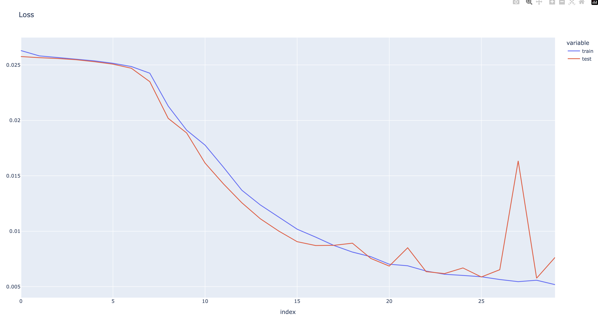
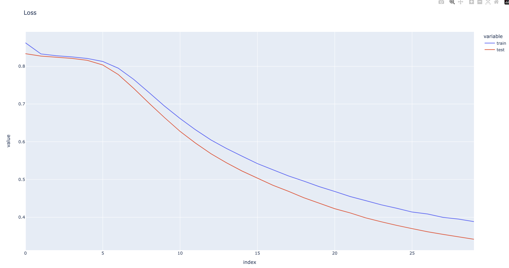

# NLP-study

# Week 1

```bash
export PYTHONPATH='.'
```

## vocab

text 뭉치를 token으로 분리하고, frequency로 자릅니다

```bash
python3 week1/vocab.py
```

## process

model에 들어갈 data 함수 (collate_fn)가 구현돼있습니다.
text 뭉치가 들어오면 cbow window size로 잘라서 정답 레이블과 함께 반환합니다.

## train

model을 train합니다.
model은 embedding layer, linear layer, softmax layer 총 3개로 구성됩니다.

## embedding

model의 embedding layer의 weight는 단어의 embedding vector입니다.
단어를 입력하면 cos similarity로 vector search를 할 수 있습니다.

```bash
python3 week1/embedding.py
```

결과

```text
Search result for happy
[(0.25120705366134644, 'smile'), (0.2296358197927475, 'comedic'), (0.2083875685930252, 'mickey'), (0.2037905603647232, 'levant'), (0.20267605781555176, 'enamel'), (0.20042675733566284, 'magnesium'), (0.1967267543077469, 'bonding'), (0.1916404813528061, 'turkish'), (0.19059233367443085, 'merchants'), (0.19032345712184906, 'greatest')]
Search result for tree
[(0.20725974440574646, 'navigate'), (0.20592263340950012, 'participant'), (0.20452527701854706, 'surveillance'), (0.19238656759262085, 'progressive'), (0.18880872428417206, 'cholera'), (0.18290741741657257, 'mm'), (0.18162289261817932, 'probation'), (0.18039745092391968, 'readiness'), (0.1799887865781784, 'enthusiastically'), (0.17668366432189941, 'trailing')]
Search result for pencil
[(0.22702734172344208, 'reviewers'), (0.22138726711273193, 'preparatory'), (0.207473024725914, 'upstairs'), (0.19565294682979584, 'confederation'), (0.19316130876541138, 'skill'), (0.19291163980960846, 'navigator'), (0.19278688728809357, 'prerogative'), (0.18978869915008545, 'classmates'), (0.18847954273223877, 'weiss'), (0.18598885834217072, 'pixar')]
Search result for king
[(0.21462133526802063, 'buddy'), (0.20818422734737396, 'skill'), (0.2075817584991455, 'miniature'), (0.20066796243190765, 'spell'), (0.19987820088863373, 'referendum'), (0.19814975559711456, 'modification'), (0.19185425341129303, 'nathan'), (0.19148951768875122, 'danger'), (0.18970902264118195, 'woodrow'), (0.18906868994235992, 'wilco')]
Search result for cloud
[(0.24785436689853668, '67'), (0.2190980464220047, 'mix'), (0.21504183113574982, 'embracing'), (0.2110539823770523, 'shady'), (0.2050158679485321, 'neighboring'), (0.20479613542556763, 'o2'), (0.202768474817276, 'trainers'), (0.20125892758369446, 'extinguished'), (0.19937607645988464, 'slate'), (0.19653087854385376, 'proto')]
Search result for king - man + woman
[(0.5836647748947144, 'woman'), (0.22479338943958282, 'battalions'), (0.21488870680332184, 'treatise'), (0.20145516097545624, 'danger'), (0.2006901502609253, 'semitic'), (0.19980493187904358, 'divinity'), (0.1926434338092804, 'penn'), (0.19237498939037323, 'bure'), (0.19137218594551086, 'coupling'), (0.1912480592727661, 'demos')]
Search result for bigger - big + small
[(0.4967832565307617, 'bigger'), (0.2382960170507431, 'walk'), (0.2306910902261734, 'bradford'), (0.2231120765209198, 'save'), (0.22001925110816956, 'convective'), (0.21074099838733673, 'asserts'), (0.20306344330310822, 'realignment'), (0.19673247635364532, '25'), (0.1941990703344345, 'describes'), (0.19376976788043976, 'northwestern')]
Search result for paris - france + germany
[(0.5483200550079346, 'paris'), (0.23175767064094543, 'administration'), (0.21463456749916077, 'synonyms'), (0.20372925698757172, 'regional'), (0.20305301249027252, 'acquisitions'), (0.20287597179412842, 'shortstop'), (0.19914253056049347, 'trigger'), (0.19742625951766968, '1960s'), (0.19466473162174225, 'steven'), (0.1933710277080536, 'topography')]
```

# Week2

RNN과 LSTM을 직접 구현합니다

## RNN

training time: 30min

```bash
python3 week2/train.py # comment out train_rnn
```

```text
=====epoch: 0=====
train accuracy: 0.26460833333333333, train loss: 0.026916384627421696
test accuracy: 0.28578947368421054, test loss: 0.025997021347284318
==========
=====epoch: 1=====
train accuracy: 0.28068333333333334, train loss: 0.02588930862719814
test accuracy: 0.29539473684210527, test loss: 0.025647442670244918
==========

...

=====epoch: 28=====
train accuracy: 0.693425, train loss: 0.005580590944713913
test accuracy: 0.6910526315789474, test loss: 0.005764961315956163
==========
=====epoch: 29=====
train accuracy: 0.69895, train loss: 0.005184677486098371
test accuracy: 0.6734210526315789, test loss: 0.007636408769390791
==========
```



## LSTM

training time: 1h 7min

```bash
python3 week2/train.py # comment out train_lstm
```

```text
epoch: 1, train loss: 0.8622180396080017, train acc: 0.25101666666666667
epoch: 1, test loss: 0.8333939167381335, test acc: 0.26526315789473687
epoch: 2, train loss: 0.8327333481152852, train acc: 0.25779166666666664
epoch: 2, test loss: 0.8270172943838504, test acc: 0.2825
...
epoch: 29, train loss: 0.3950780501564344, train acc: 0.5993083333333333
epoch: 29, test loss: 0.3479630156349735, test acc: 0.6290789473684211
epoch: 30, train loss: 0.3883372766276201, train acc: 0.601875
epoch: 30, test loss: 0.3415672565896471, test acc: 0.6325
```

