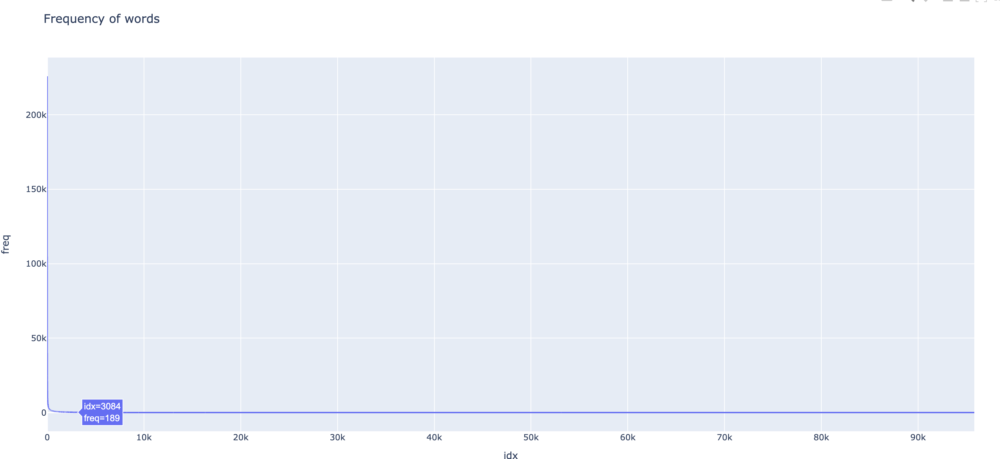
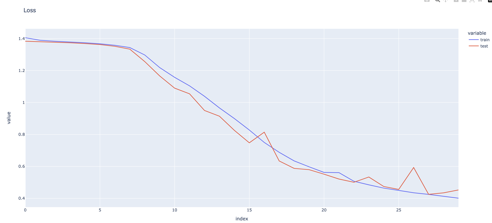
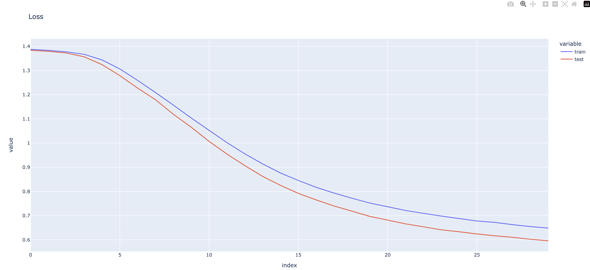
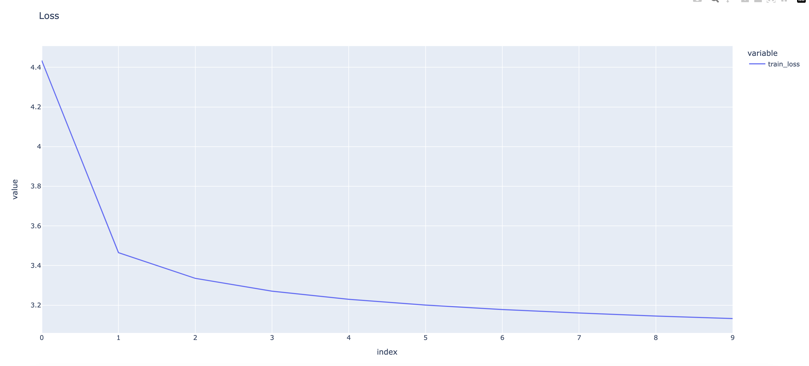
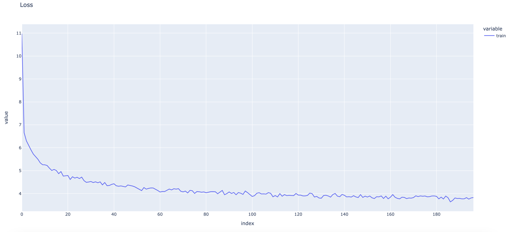

# NLP-study

libs 폴더를 두기 때문에 모든 파일은 루트에서 실행합니다.

```bash
export PYTHONPATH='.'
```

# Week 1

## vocab

text 뭉치를 token으로 분리하고, frequency로 자릅니다

```bash
python3 week1/vocab.py
```

## process

model에 들어갈 data 함수 (collate_fn)가 구현돼있습니다.
text 뭉치가 들어오면 cbow window size로 잘라서 정답 레이블과 함께 반환합니다.

## train

model을 train합니다.
model은 embedding layer, linear layer, softmax layer 총 3개로 구성됩니다.

## embedding

model의 embedding layer의 weight는 단어의 embedding vector입니다.
단어를 입력하면 cos similarity로 vector search를 할 수 있습니다.

```bash
python3 week1/embedding.py
```

결과

```text
Search result for happy
[(0.25120705366134644, 'smile'), (0.2296358197927475, 'comedic'), (0.2083875685930252, 'mickey'), (0.2037905603647232, 'levant'), (0.20267605781555176, 'enamel'), (0.20042675733566284, 'magnesium'), (0.1967267543077469, 'bonding'), (0.1916404813528061, 'turkish'), (0.19059233367443085, 'merchants'), (0.19032345712184906, 'greatest')]
Search result for tree
[(0.20725974440574646, 'navigate'), (0.20592263340950012, 'participant'), (0.20452527701854706, 'surveillance'), (0.19238656759262085, 'progressive'), (0.18880872428417206, 'cholera'), (0.18290741741657257, 'mm'), (0.18162289261817932, 'probation'), (0.18039745092391968, 'readiness'), (0.1799887865781784, 'enthusiastically'), (0.17668366432189941, 'trailing')]
Search result for pencil
[(0.22702734172344208, 'reviewers'), (0.22138726711273193, 'preparatory'), (0.207473024725914, 'upstairs'), (0.19565294682979584, 'confederation'), (0.19316130876541138, 'skill'), (0.19291163980960846, 'navigator'), (0.19278688728809357, 'prerogative'), (0.18978869915008545, 'classmates'), (0.18847954273223877, 'weiss'), (0.18598885834217072, 'pixar')]
Search result for king
[(0.21462133526802063, 'buddy'), (0.20818422734737396, 'skill'), (0.2075817584991455, 'miniature'), (0.20066796243190765, 'spell'), (0.19987820088863373, 'referendum'), (0.19814975559711456, 'modification'), (0.19185425341129303, 'nathan'), (0.19148951768875122, 'danger'), (0.18970902264118195, 'woodrow'), (0.18906868994235992, 'wilco')]
Search result for cloud
[(0.24785436689853668, '67'), (0.2190980464220047, 'mix'), (0.21504183113574982, 'embracing'), (0.2110539823770523, 'shady'), (0.2050158679485321, 'neighboring'), (0.20479613542556763, 'o2'), (0.202768474817276, 'trainers'), (0.20125892758369446, 'extinguished'), (0.19937607645988464, 'slate'), (0.19653087854385376, 'proto')]
Search result for king - man + woman
[(0.5836647748947144, 'woman'), (0.22479338943958282, 'battalions'), (0.21488870680332184, 'treatise'), (0.20145516097545624, 'danger'), (0.2006901502609253, 'semitic'), (0.19980493187904358, 'divinity'), (0.1926434338092804, 'penn'), (0.19237498939037323, 'bure'), (0.19137218594551086, 'coupling'), (0.1912480592727661, 'demos')]
Search result for bigger - big + small
[(0.4967832565307617, 'bigger'), (0.2382960170507431, 'walk'), (0.2306910902261734, 'bradford'), (0.2231120765209198, 'save'), (0.22001925110816956, 'convective'), (0.21074099838733673, 'asserts'), (0.20306344330310822, 'realignment'), (0.19673247635364532, '25'), (0.1941990703344345, 'describes'), (0.19376976788043976, 'northwestern')]
Search result for paris - france + germany
[(0.5483200550079346, 'paris'), (0.23175767064094543, 'administration'), (0.21463456749916077, 'synonyms'), (0.20372925698757172, 'regional'), (0.20305301249027252, 'acquisitions'), (0.20287597179412842, 'shortstop'), (0.19914253056049347, 'trigger'), (0.19742625951766968, '1960s'), (0.19466473162174225, 'steven'), (0.1933710277080536, 'topography')]
```

# Week2

RNN과 LSTM을 직접 구현합니다

## Data Analysis

```bash
python3 week2/vocab.py
```

### frequency

```text
=====test data analyze=====
label_count: [1900, 1900, 1900, 1900]
max_len: 161
min_len: 14
vocab with freq saved 25272
vocab_0_10000 saved 25269
vocab_10_10000 saved 3488
vocab_30_10000 saved 1348
vocab_50_10000 saved 808
=====train data analyze=====
label_count: [30000, 30000, 30000, 30000]
max_len: 207
min_len: 12
vocab with freq saved 95812
vocab_0_10000 saved 95771
vocab_10_10000 saved 19466
vocab_30_10000 saved 10600
vocab_50_10000 saved 7796
```



## RNN

training time: 30min

```bash
python3 week2/train.py # comment out train_rnn
```

```text
epoch: 1, train loss: 1.405393164730072, train acc: 0.25256666666666666
epoch: 1, test loss: 1.383200773171016, test acc: 0.26421052631578945
epoch: 2, train loss: 1.3892573095639547, train acc: 0.26510833333333333
epoch: 2, test loss: 1.3804954535820906, test acc: 0.2906578947368421
...
epoch: 29, train loss: 0.41325390228827796, train acc: 0.8618333333333333
epoch: 29, test loss: 0.4343584297271837, test acc: 0.8542105263157894
epoch: 30, train loss: 0.4009424129376809, train acc: 0.8669916666666667
epoch: 30, test loss: 0.4524909596921516, test acc: 0.8446052631578947
```



## LSTM

training time: 1h 7min

```bash
python3 week2/train.py # comment out train_lstm
```

```text
epoch: 1, train loss: 1.3875940755526224, train acc: 0.25738333333333335
epoch: 1, test loss: 1.3836254312210725, test acc: 0.2719736842105263
epoch: 2, train loss: 1.3831375082333883, train acc: 0.2748
epoch: 2, test loss: 1.3794252391622848, test acc: 0.2875
...
epoch: 29, train loss: 0.6548505994637808, train acc: 0.758025
epoch: 29, test loss: 0.6023607878875332, test acc: 0.7852631578947369
epoch: 30, train loss: 0.6487111969351769, train acc: 0.763125
epoch: 30, test loss: 0.5960645601779473, test acc: 0.7871052631578948
```



## RNN vs LSTM

LSTM은 cell state와 hidden state 2가지를 가지고 있지만, RNN은 hidden state 하나만 갖고 있습니다.
그래서 연속된 데이터 형태에서 처음 나온 데이터를 더 잘 기억할 수 있습니다.

### Train data

아래는 훈련 데이터 중 LSTM이 맞고, RNN이 틀린 예시입니다.

```bash
python3 week2/compare.py
```

```text
sentence:  Stocks Fall on Oil, Dow Ends Below 10,000 (Reuters) Reuters - The blue-chip Dow Jones average closed\below 10,000 for the first time in about six weeks on Monday as\a spike in oil prices to nearly  #36;50 a barrel renewed concerns\about corporate profits while analysts cutting recommendations\hurt tech stocks.
RNN model prediction:  Sci/Tech
LSTM model prediction:  Business
Business

sentence:  Diageo says Cheerio to US stake Diageo, the world's biggest spirits company, is selling most of its 20 stake in US food company General Mills to ease its 4.5bn (\$8bn) debt burden.
RNN model prediction:  Sci/Tech
LSTM model prediction:  Business
Business

sentence:  The Gainesville Sun Ron Zook has been relived of his duties as the Florida football head coach effective at the end of the season, Florida athletic director Jeremy Foley confirmed Monday.
RNN model prediction:  Business
LSTM model prediction:  Sports
Sports

sentence:  Cemex buying UK #39;s RMC Group Mexico #39;s Cemex, one of the world #39;s largest makers of concrete will pay \$4.1 billion for British rival RMC Group, the Wall Street Journal reported Monday.
RNN model prediction:  Sci/Tech
LSTM model prediction:  Business
Business

sentence:  Tokyo Stocks Open Higher, Exporters Lead  TOKYO (Reuters) - The Nikkei average opened 0.69 percent  higher on Wednesday as gains on Wall Street eased uncertainty  ahead of the Nov. 2 U.S. presidential election, prompting  buying of Toyota Motor Corp. and other exporters.
RNN model prediction:  Sci/Tech
LSTM model prediction:  Business
Business
```

### My data

RNN이 두괄식 문장에 약하다는 것을 알 수 있고, 이를 통해 두 모델의 결과가 다른 예시를 구성할 수 있습니다.

```text
sentence:  ABC company is going to launch a new product. ABC company is a tech company
RNN model prediction:  Sci/Tech
LSTM model prediction:  Business
Business
sentence:  In football season with many athletes, the Lakers defeated the Warriors.
RNN model prediction:  Business
LSTM model prediction:  Sports
Sports
sentence:  Research data has been presented in the conference. It is about the performance of athletes which is sponsored by ABC company
RNN model prediction:  Business
LSTM model prediction:  Sci/Tech
Sci/Tech
```

# Week3

transformer를 직접 구현합니다.

## Transformer

모델 구조는 논문 + [인터넷](https://wikidocs.net/31379)을 참고했으며, 학습 파라미터는 논문을 보며 그대로 따라했습니다.

논문에서 batch size는 500이고 warmup step이 4000인데, 메모리 이슈로 250, 8000으로 조정했습니다.

(warmup step을 배치당 평균 토큰 수의 합을 기준으로 맞췄다길래 2배)

epoch은 논문에서는 6이지만 마지막에 그냥 10으로 해봤습니다

### train

training time : 6epoch - over 24hr, 10epoch - over 30hr

```bash
python3 week3/train.py
```

### loss

```bash
python3 week3/plot.py
```

(맨 처음 loss는 10 정도 합니다)



### test

```bash
python3 week3/test.py
```

bleu score : 48.7

### translation example

```bash
python3 week3/test.py # comment out generate_examples()
```

```text
=================================
The quick brown fox jumps over the lazy dog.
der schnelle bra une fuchs spr ang über den fau len hund .
=================================
Every morning, I enjoy a cup of coffee while watching the sunrise.
jeden morgen genie ße ich eine tasse kaffee , während ich den sonnen auf gang beobach te .
=================================
Technology is rapidly advancing, transforming how we live and work.
die technologie schreitet rasch voran und verändert unsere lebens - und arbeits weise .
```

# Week4

gpt-2 small을 직접 구현합니다.

## GPT-2

모델 구조는 아래 링크들을 참고했습니다.

1. [gpt1 논문](https://s3-us-west-2.amazonaws.com/openai-assets/research-covers/language-unsupervised/language_understanding_paper.pdf)
2. [gpt2 논문](https://d4mucfpksywv.cloudfront.net/better-language-models/language_models_are_unsupervised_multitask_learners.pdf)
3. [minGPT 코드](https://github.com/karpathy/minGPT)
4. [gpt2 모델 설명](https://jalammar.github.io/illustrated-gpt2/)

메모리 이슈로 batch size를 64로 많이 줄였고, learning rate는 간단하게 고정했습니다

### train

training time: over 30hr

```bash
python3 week4/train.py
```

### loss

```bash
python3 week4/plot.py
```



### test

```bash
python3 week4/test.py
```

```text
cross entropy: 4.801433165868123
perplexity: 121.6846869504162
```

### generate

```bash
python3 week4/generate.py
```

```text
<prompt> My name is Teven and I am
<generated> 
 glad to be in my teens. i got an invitation to do my two cents a day. this is for my niece, my sister, and that little girl. there wasn't even a chance they would not want her anyway. i was quite upset. i am very sorry because i'm not my father.

after the event was over i was in my youth but i was also trying to get out of bed and sleep in bed and i got out to see my sister at the end and
====================

<prompt> I am a student at KAIST
<generated> 
u university in the united states. the i do not have a masters degree. i do not live in new york but if i have an education i may have to stay here. i am currently studying with a phd candidate and i would not do my research.

my research and skills have grown in recent years and i have grown accustomed to working on my education.

in my research i have grown in the same area. you have to have your education in order to be successful and productive
====================

<prompt> I like to eat
<generated> 
 it and this is the biggest moment the internet has ever seen:

a lot of our favorite websites, videos, websites and everything else is going on. it is being done by the whole of the adult web. they’re doing everything they can to stop people doing things that are not just important to the children or their lives or the lives of those in their communities.

the idea isn’t even an attempt to stop people doing things like this and doing it by the whole of%
```

# Week5

논문을 읽고 요약합니다. (`week5/` 참고)

# Week6

LoRA를 peft 라이브러리를 사용하여 / 직접 구현합니다.

## sft with library

library를 사용해서 비교적 짧은 코드로 sft를 진행할 수 있습니다. (r=8, alpha=32, dropout=0.1, (q, v))

dataset은 적당한 전처리 과정을 거쳤습니다.

```bash
python3 week6/lora.py
```

## sft with my code

직접 구현한 LoRA 코드입니다. (r=8, alpha=16, dropout=0.1, (q, k, v, o))

peft 라이브러리를 참고하여 (세부 구현은 많이 다릅니다) wrapper module을 하나 두고 layer를 갈아끼우는 방식으로 구현했습니다. 

*pretrain model을 학습 중간에 저장할 때 모델 사이즈가 커서 모든 weight를 저장하는 게 너무 오래 걸려서 (몇십GB단위...) adapter weight만 저장하고, 불러올 때 adapter weight만 불러오는  방식으로 구현하려 했으나 huggingface  이슈가 끊이질 않아서 포기했습니다.*

```bash
python3 week6/my_lora.py
```

## plot losses

아래는 my_lora의 loss 그래프입니다.

*library로 sft할 때 깜빡하고 loss를 저장 안했네요*

```bash
python3 week6/plot.py
```


## evaluate

metric은 accuracy입니다. shuffle한 후 100개 샘플로 측정했습니다.

model이 생성한 sql을 label query와 비교할 때 logical form 혹은 실행 결과로 비교하는 작업을 코드를 작성하기에는 부담이 있고, 데이터셋의 쿼리가 nested query가 아니라 비교적 간단해서 exact query만 비교했습니다.

### evaluate sft model with library

```bash
python3 week6/evaluate.py
```

```text
...
accuracy: 0.75
```

아래는 생성 예시입니다. (`### SQL`부터 `</s>`까지가 모델이 생성한 텍스트)

```text
<s> ### Table
col : Series # | Season # | Title | Directed by | Written by | Original air date row 1 : 248 | 1 | "The Little Match Girl" | James Burrows | Dan Staley and Rob Long | September24,1992 row 2 : 249 | 2 | "The Beer Is Always Greener" | James Burrows | Tom Leopold | October1,1992 row 3 : 250 | 3 | "The King of Beers" | John Ratzenberger | Dan O'Shannon | October8,1992
### Question
What date did episode 258 in the series originally air?
### SQL
SELECT Original air date FROM table WHERE Series # = 258</s>

label query: SELECT Original air date FROM table WHERE Series # = 258
predicted query: SELECT Original air date FROM table WHERE Series # = 258

<s> ### Table
col : Player | Touchdowns | Extra points | Field goals | Points row 1 : Tom Hammond | 2 | 12 | 0 | 22 row 2 : Norcross | 4 | 0 | 0 | 20 row 3 : Heston | 3 | 0 | 0 | 15
### Question
How many points does Tom Hammond have if he has more than 12 points?
### SQL
SELECT COUNT Points FROM table WHERE Player = tom hammond AND Points > 12</s>

label query: SELECT SUM Points FROM table WHERE Player = tom hammond AND Extra points > 12
predicted query: SELECT COUNT Points FROM table WHERE Player = tom hammond AND Points > 12

<s> ### Table
col : Branding | Callsign | Frequency | Power (kW) | Location row 1 : Hot FM 92.5 Santiago [ citation needed ] | DWHT | 92.5MHz | 5kW | Santiago City row 2 : Hot FM 92.1 Labo, Camarines Norte | DWBO | 92.1MHz | 5kW | Labo, Camarines Norte row 3 : Hot FM 93.1 Laoag | DWNA | 93.1MHz | 1kW | Laoag City
### Question
What is the branding for callsign dypv?
### SQL
SELECT Branding FROM table WHERE Callsign = DYPV</s>

label query: SELECT Branding FROM table WHERE Callsign = DYPV
predicted query: SELECT Branding FROM table WHERE Callsign = DYPV
```

### evaluate sft model with my code

```bash
python3 week6/my_evaluate.py
```

```text

```

아래는 생성 예시입니다.

```text

```