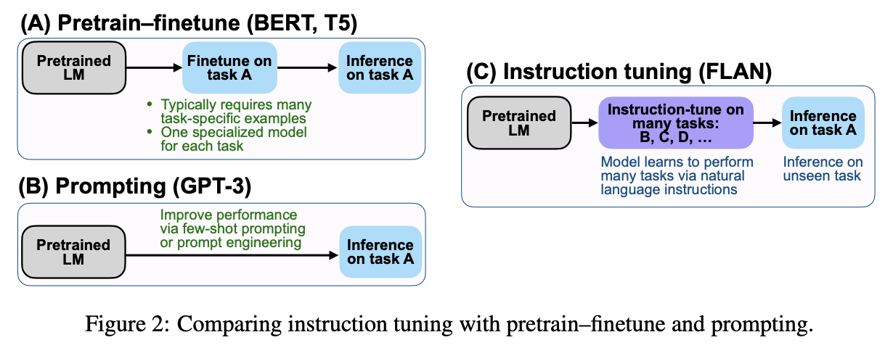
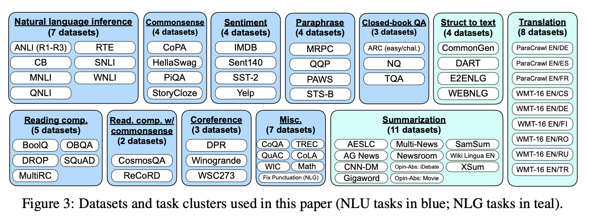
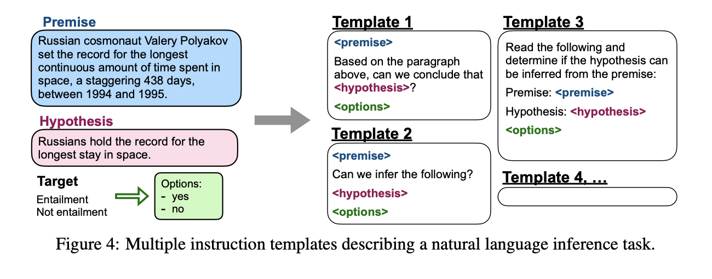
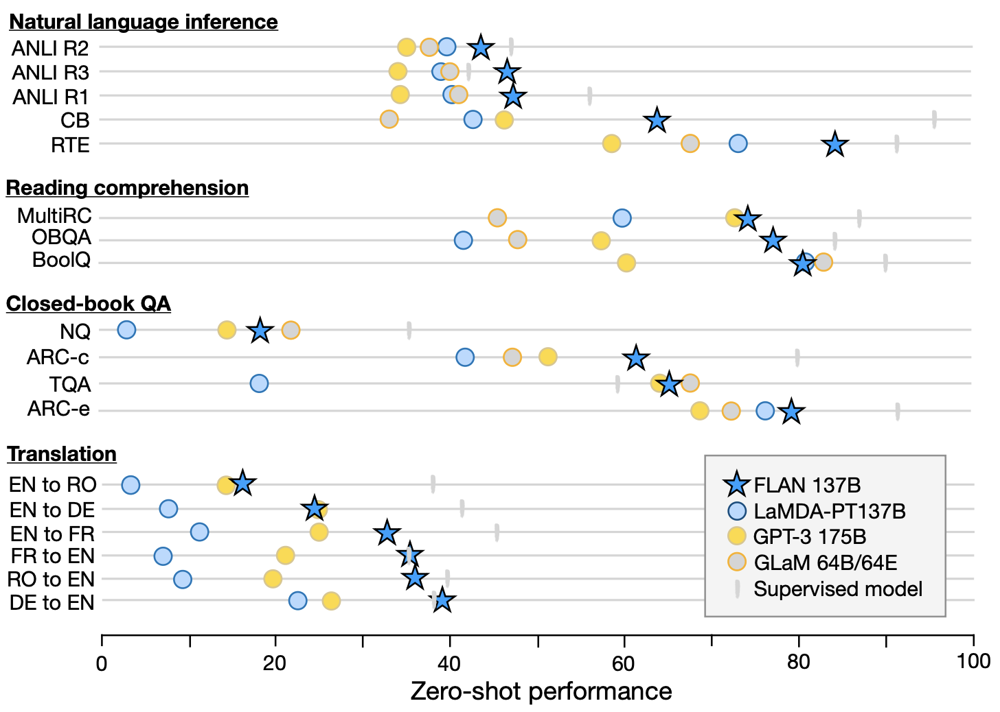
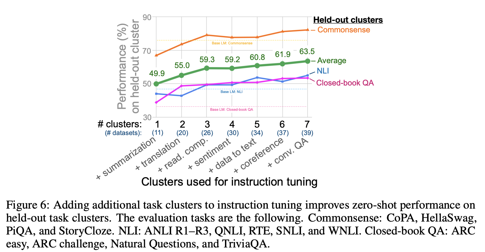
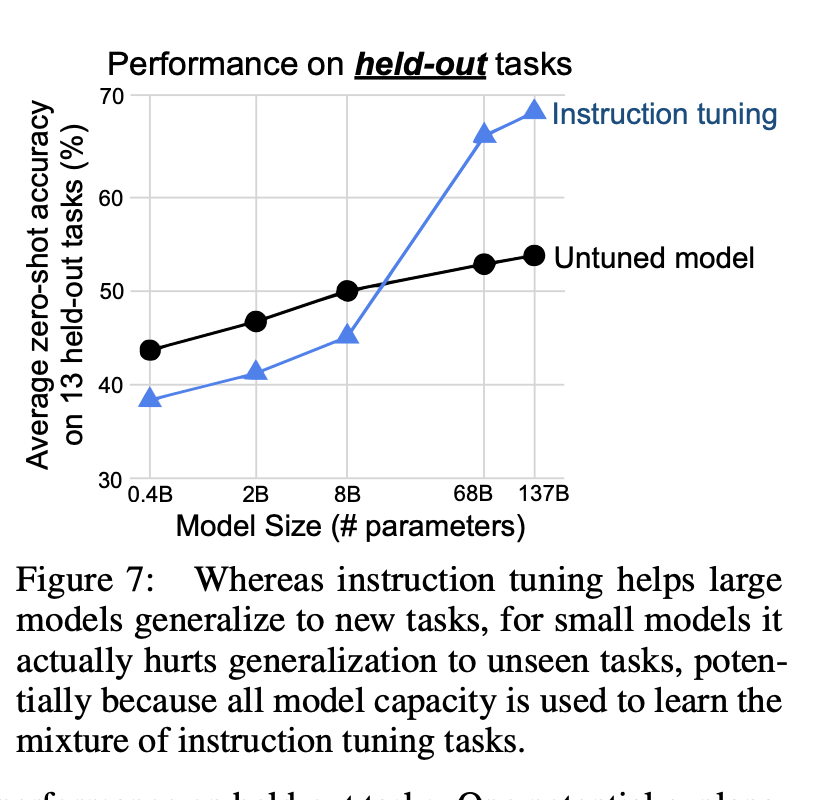
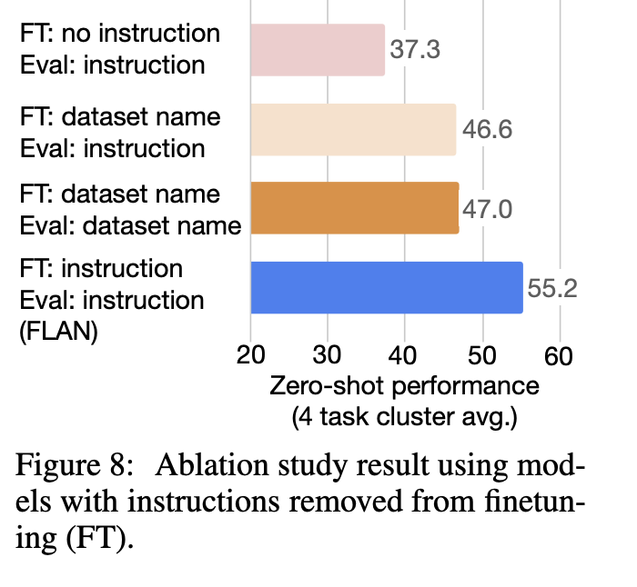
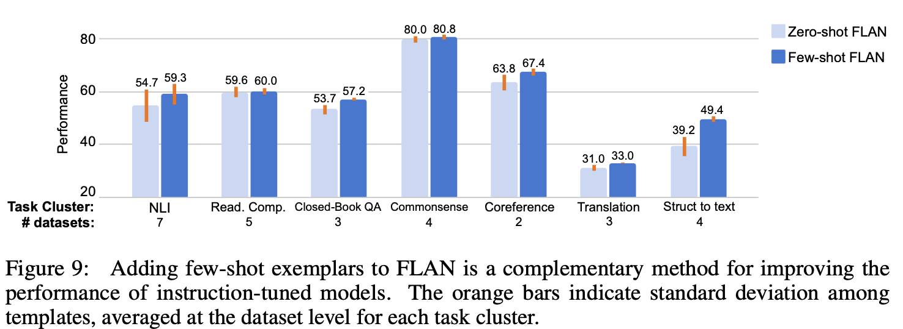
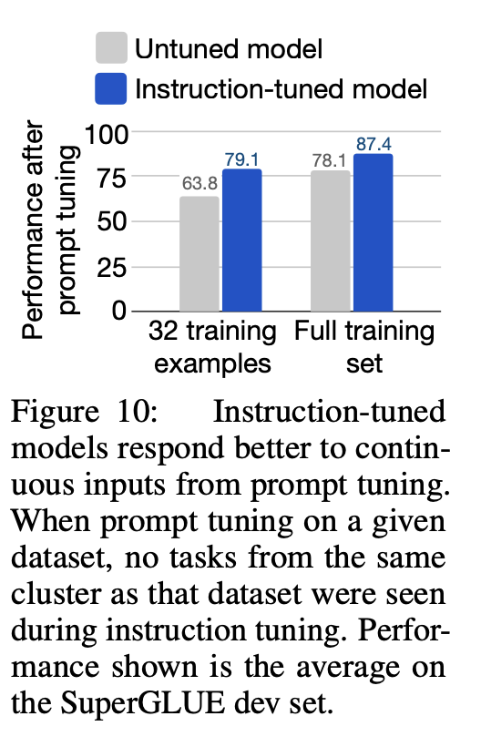

# Intro

fine tuning을 더 잘 했더니, (insruction tuning) gpt-3보다 개선된 결과를 보였고 unseen task(fine tuning하지 않은 task)도 잘 이해하는 결과를 보였다고 하는 논문이다.
URL: <https://openreview.net/pdf?id=gEZrGCozdqR>

# Instruction tuning

논문에서는 task별로 여러 개의 dataset을 두고, task를 종류별로 clustering했으며,  실험마다 제외할 cluster를 제외한 뒤, 남은 cluster들을 이용해서 instruction tuning한 뒤에, 평가할 때는 모든 task를 평가한다.

위 그림은 instruction tuning을 나타내는 그림인데, 하나의 샘플에 prompt를 다르게 해서 샘플을 여러 개 생성하여 fine tuning하는 것이다. task를 여러 버전의 자연어 프롬프트로 풀어서 모델이 task 뿐만 아니라 task를 수행하는 것 자체에 대해서 더 잘 이해하도록 하기 위함이다.

NLI task에 대해서는 gpt보다 엄청 큰 갭으로 outperform한다고 강조하는데, 이는 training data에서는 보통 NLI task를 이해하기 위한 문장 구조가 잘 안나오기 때문이라고 한다. FLAN에서는 instruction tuning을 이용해 좀 더 풀어 써서 task를 잘 이해해서 위와 같은 결과가 나왔다고 한다.

translation task에 대해서는 gpt와 비슷하게 나왔고, english에서 다른 언어로 번역하는 것에 대해서는 주로 tokenizing과 pre training이 English로 해서 잘 못했다고 한다. (supervised model과 갭차이가 심함)

그리고 commonsense reasoning과 같은 프롬프트가 그다지 필요없는 영역에서는 성능 향상을 보이지 않았다고 한다.

위에서 말한 cluster를 제외하고 평가하는 방식을 여러 개에 대해서 해봤을 때, (평가는 commonsense, nli, closed book qa로 고정) 여러 task cluster를 instruction tuning시킬 수록 전반적인 성능이 올라갔다고 한다.

model size가 올라가면 instruction tuning이 엄청 효율이라고 한다. model size가 작을 때는 오히려 성능이 감소하는 걸 볼 수 있는데, 이는 모델의 능력이 한계가 있어서 다른 거 배우면 이전 걸 까먹는다고 추측한다.

instruction이 정말로 효과가 있는지 (instruction tuning이 아니라 단지 multi task fine tuning이 잘 돼서 그런 것일 수 있으므로) 각 dataset에서 instruction 없이, 혹은 task name만 명시해서 각각 비교해봤는데, 역시 성능 향상에 있어 instruction이 큰 영향을 미쳤다고 한다.

zero shot 뿐만 아니라 few shot에서도 성능 향상을 보였다고 한다.

instruction을 더 잘 따르게 된 것이므로, prompt tuning이 더 효과적이었다고 한다.

# Outro

instruction을 더 잘 이해시키기 위해서 각각의 task를 프롬프트 바꿔서 fine tuning했더니 unseen task에 대해서도 성능 향상을 보였다는 것, 그리고 task cluster를 포함시킬 수록 더 잘 한다는 것이 인상적이었고 너무 신기한 결과였다.
