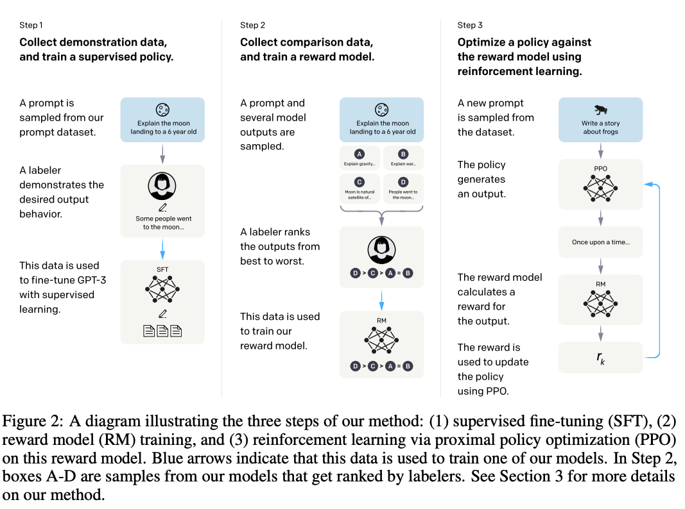

# Intro

그 전까지의 model은 natural language에 대해서만 잘 하는 느낌이라면, (question answering 같은 task만 잘 하면 되는 느낌이었다면) 이 논문은 llm이 사람의 의도를 파악하고, 도움이 말을 하는 것, 즉 llm에 대해서 align 시켜본 논문이다.

URL: <https://arxiv.org/pdf/2203.02155.pdf>

# RLHF

다른 논문에서 소개된 RLHF를 openai는 위 방식으로 했다고 한다. (labeler를 여러 명 고용해서 직접 데이터를 만듦, step 2까지 labeler 인력이 사용된다.)

## Step 1. supervised fine tuning

labeler들이 만든 데이터를 직접 fine tuning함

데이터셋은 openai playground에서 api로 모든 데이터를 사용했다고 한다. InstructGPT를 sft(step 1, supervised learning)를 조금만 해서 베타로 풀었던 것 같다.

## Step 2. reward modeling

llm이 생성한 여러 개의 답안으로부터 labeler들이 rank를 매기고, 이를 통해서 raward model을 학습시킴

위 수식은 reward modeling step에서 reward model의 loss이다. llm이 하나의 프롬프트(샘플)에 대해서 4~9개의 답안을 생성하면, labeler들이 랭킹을 하고, 하나의 샘플에 k(k-1)/2번 update하지 않고 (overfitting을 피하기 위해서) 저렇게 한꺼번에 계산된 loss를 이용해서 한번에 update한다.

## Step 3. reinforcement learning

학습된 reward model을 통하여 llm 학습

PPO 알고리즘은 강화학습에서 나오는 용어로, 위에서 감마를 0으로 하면 pure PPO algorithm이라고 한다. (찾아보면서 알았는데 PPO 알고리즘도 openai가 2017년에 발표한 논문에서 나온 알고리즘이다… 잘은 모르지만 old policy와 new policy 간의 차이가 너무 크게 발생하지 않도록 강화학습을 하는 알고리즘인 듯 하다.)

reward를 업데이트할 때 원래 pretrain된 학습, 즉 언어에 대한 이해까지 버리면서 강화학습 하는 걸 막기 위해서 pretrain할 때 계산되는 gradient를 같이 넣어준다. (감마계수가 붙어있는 항)

# Evaluate

논문에서 보면 어떤 게 alignment가 잘 맞는 건지 말하고 있는데, helpful, honest, harmless 이 3개의 키워드가 나온다. (애매하고, 측정하기 어렵다고 말함) 이를 어떻게 실용적으로 정의했는지 나와있다.

## Helpful

helpful은 prompt의 의도를 잘 이해하고 답하는 것을 말한다. “Q: ~~, A: ” 라고 했을 때 질문에 대한 답을 원한다는 걸 알아야 하고, 문장이 갑자기 끝난다면 generation을 원한다는 걸 알아야 한다.

## Honest

honest는 deep learning model의 특성상 모델이 블랙박스이기 때문에, 실제 모델이 honest하게 내놓은 답인지 알 수 없다. 그래서 hallucination과 TrusthfulQA 데이터셋을 이용해서 측정했다고 한다.

## Harmful

harmful도 측정하기 매우 어려운데, toxic output을 내는 지가 주요 평가 기준이었다고 한다. 처음에는 toxic =  potentially harmful이 평가 기준이었으나, 너무나 애매했기에 specific toxic area(sexual or violent content, 비하 발언, 예의 없는 모습을 보이는 등등)에 집중했다고 한다.

# Results

## Helpful

labeler의 preference를 통해서 결과를 나타내는 그래프이다. step 3에서 사용된 pretrain mix (PPO-ptx)가 labeler preference에 있어 드라마틱한 효과를 보이지는 않았다고 한다.

## Honest

honest하다고 한다!

## Harmful

respectful prompt (safe, respectful output을 만들어내게 하는 prompt)에서는 less toxic이지만, respectful prompt가 없을 땐 gpt보다 더욱 harmful한 output을 만들어낸다고 한다. 그리고 일부러 toxic한 output을 내게 하려고 했을 때도 gpt보다 더 harmful하다고 한다. (자기네들이 따로 낸 결론이 있는데, sft 모델은 가장 toxic하지 않았지만, labeler들 사이에서 가장 rank가 낮았다고 한다)

bias는 unclear pattern을 띠고 있다고 한다.

PPO ptx 가 performance regression 방지에 도움이 됐다고 한다.

# Discussion

## Implications of alignment research

pretraining보다 alignment시키는 게 cost effective하다고 한다. 그리고 supervise하지 않은 task에 대해서도 following instruction하는 방법을 익혀서 잘 따른다고 한다. (이건 labeler들이 쓴 프롬프트들이 FLAN 논문의 경우와 비슷해서가 아닐까?)

이 밖에 논문에서는 labeler를 비롯해서 여러 한계들을 지적한다.

## Broader impacts

가슴이 웅장해진다… 요약할 게 없다

# Outro

개인적으로 너무나 기발하고 반짝이는 아이디어라고 생각했다. 지금까지 읽은 논문 중에서 제일 재밌었고 가슴이 웅장해졌다. 그동안 nlp 분야에서 쌓아온 성과들이 리서치 단계에서 그치지 않고 사람에게 직접적으로 도움이 될 수 있게 만드는 걸 느꼈다. decoder 기반 text generation 모델 구조에서 text generation을 잘 하는 게 목표가 아니라, 즉 그냥 주어진 task를 잘 하면 된다는 게 아니라 인간에게 도움이 되는 방향으로 교육시킨다니 너무나 똑똑하고, 똑똑함을 넘어선 그 이상의 사람들이라는 생각이 들었다. 철학적으로도 많은 생각을 하게 됐다.
