# Scaling Law

URL: <https://arxiv.org/pdf/2001.08361.pdf>
상태: 완료
최종 편집 일시:_24년 1월 15일 오전 1:49

# Intro

이 논문은 전체적으로 model size와 compute resource, dataset size의 다양한 상황에서의 loss와의 상관관계를 실험적으로 얻어낸 결과를 공유하는 논문이다.

*수식은 그냥 캡처로 하겠다*

# Notation

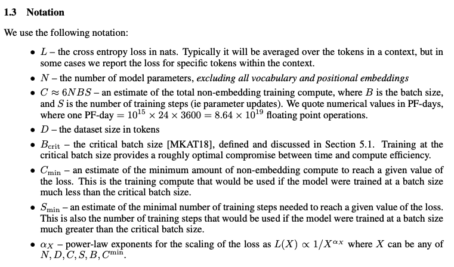

L은 loss, N은 model size, B는 batch size, S는 number of training step이라고만 알면 된다.

# Empirical results

논문에서의 모든 모델은 transformer 모델을 사용한다. 해당 모델을 아는 사람라면 어떤 변수가 뭘 뜻하는 지 알 것이므로 설명은 생략하겠음

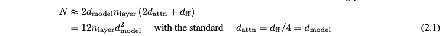

transformer 구조에서 embedding params, linear layer의 bias, batch norm params 등등을 제외한 N은 위와 같이 근사할 수 있으며,

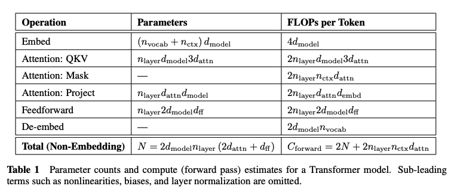

backward까지 했을 때 (근사적으로 forward의 2배) 토큰 하나당 `C = 6N` 으로 근사할 수 있다. (그럼 training할 때 드는 compute는 `C = 6NBS`이다.)

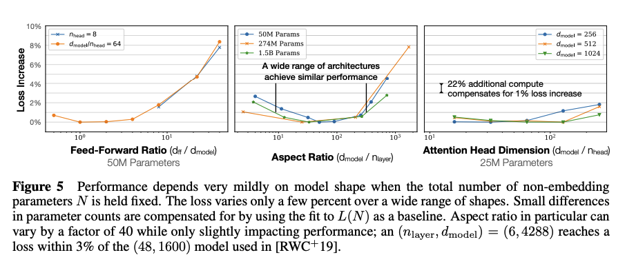

N이 픽스돼있고 transformer 내의 변수들을 조정해봤을 때 loss 차이가 아주 미세하다는 걸 보여주는 그래프이다. 이로부터 **L이 model shape에는 별로 의존하지 않고 model size N에 많이 의존한다는 것을 알 수 있다.**

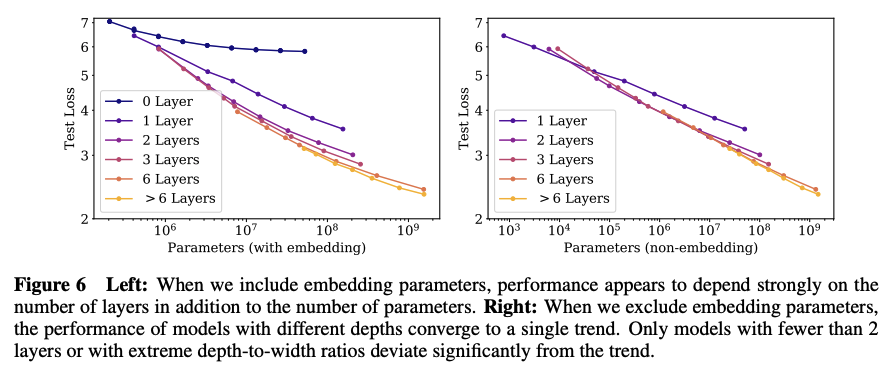

embedding params를 제외하지 않고 / 제외하고 N과 L을 비교하는 그래프이다. 제외할 때 트렌드가 깔끔하게 보이는 것을 알 수 있는데(이 논문에서의 N이 embedding params를 제외하는 이유), 이는 최근 연구 결과와 같이 볼 때 비교적 비슷한 성능 범위 내에서 **embedding matrix의 params를 충분히 줄일 수 있다는 걸 뜻한다고 한다.**

N이 비슷할 때 LSTM과도 성능을 비교해봤는데, LSTM이 context 초반에는 transformer와 성능이 비슷하다가 후반에는 transformer가 확실히 더 잘한다고 한다. 심지어 token index와 loss간에 power law 관계도 발견했다고 한다.

# Scaling laws

## Infinite data limit and overfitting

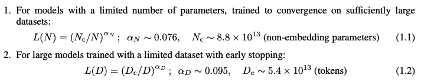

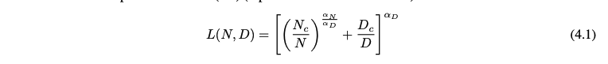

위 trend를 실험적으로 얻어냈다고 한다. 밑에 나온 관계는 3가지 원리(혹은 가정?)으로 1과 2로부터 만들어졌다고 한다.

1. vocab size 혹은 tokenization이 변하게 되면 위 변수들이 모두 변하게 됨 (이게 Nc와 Dc가 별로 중요하지 않은 이유라고 한다)
2. N이 무한으로 가면 위에 나온 L(D), D가 무한으로 가면 L(N)으로 수렴한다
3. L(N, D)는 D가 무한일 때 analytic해서 1/D의 정수 지수항들로 전개할 수 있음 (이론적 근거는 빈약하댔음)

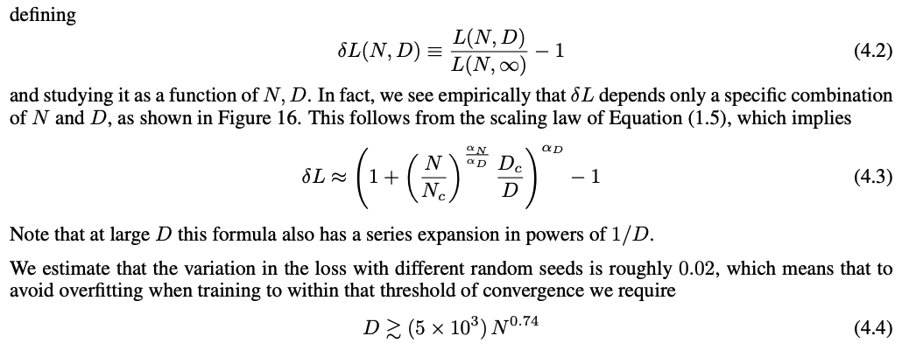

위 식이 도출된 건 잘 이해가 안 됐다. full WebText2 dataset에서 overfitting의 sign은 없었고(validation loss가 다시 안 올라감), 이때의 상황이 D가 무한이라고 한다. 그래서 4.2 식으로 가정을 세워볼 수 있다고 한다. *음…* 4.4 식에서 **overfitting을 피하기 위해서는 N이 증가함에 따라 D를 sublinearly grow (N의 0.74승에 비례)시켜야 한다고 한다.**

## Model size and training time

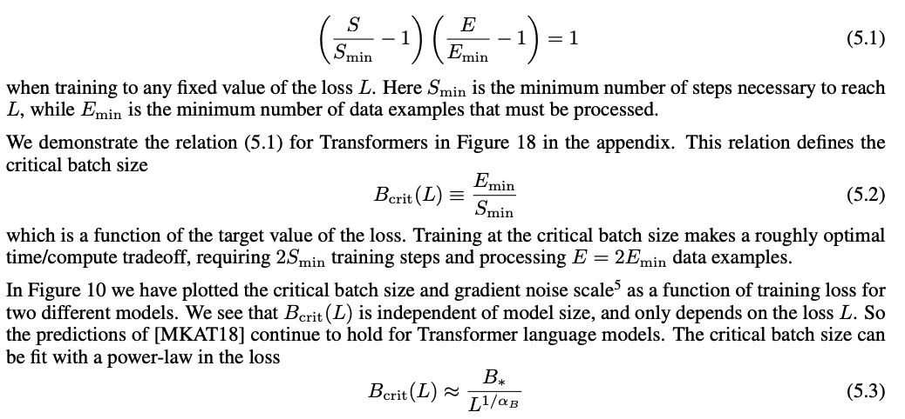

위에서 언급한 notation에서 Bcrit은 time과 compute의 적절한 타협을 보는 B라고 했다. 그게 위에서 나온다. (아마 time과 step이 완전 비례한다는 게 전제인 듯, 5.1도 실험적 결과이다) **Bcrit도 N에 상관없이 L에 의해서만 결정된다고 한다.**

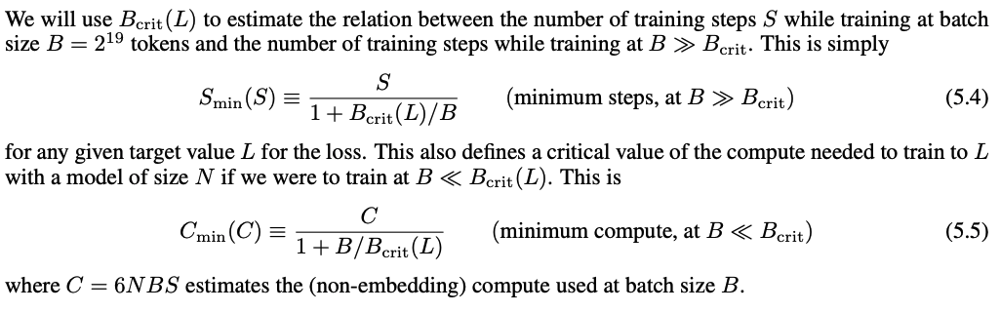

5.4와 5.5로부터 Smin, Cmin을 정의했다고 하는데 이것도 (특히 Smin, Cmin이 상수가 아니라 S, C의 함수인 게) 잘 이해가 안 됐다.

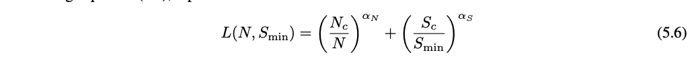

위 식도 실험적으로 구한 거라고 했는데, 이후의 5장은 무슨 말인지 이해가 안 됐다.

# Optimal allocation of compute budget

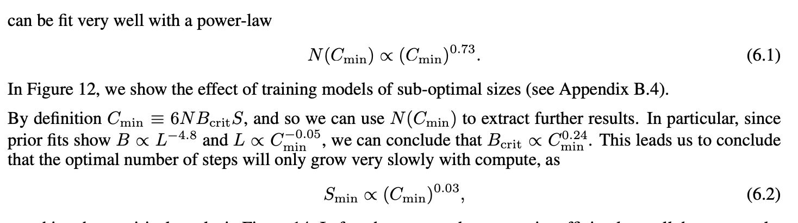

C가 늘어날수록 N은 0.73승배, Bcrit은 0.24배, Smin은 0.03배로 커져야 한다고 한다. (6.1도 실험적으로 얻은 식)

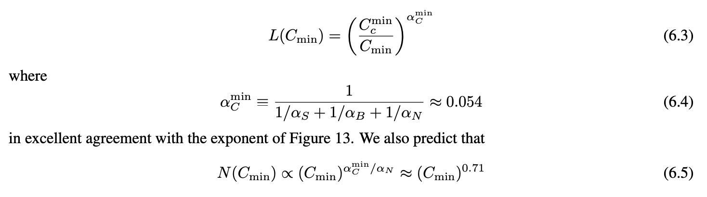

L(N, Smin)으로부터 도출한 결과와도 비슷하다고 한다.

# Outro

되게 수식이 많고, 그것도 대부분 실험적으로 도출한 식이라서 아 그렇구나~ 하고 넘어간 게, 그리고 그냥 이해 안되는 게 많은 논문이었다… ㅠ

- transformer는 model shape은 별로 안 중요
- model size가 엄청 중요하다. model size가 엄청 크면 conpute efficient해짐. (sample efficient)

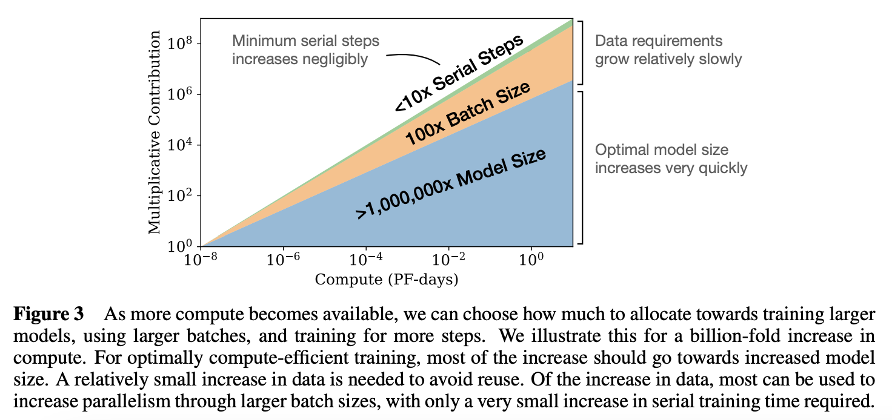

- compute가 늘어남에 따라 각 변수에 얼마나 집중해야 할 지 알 수 있었다.
